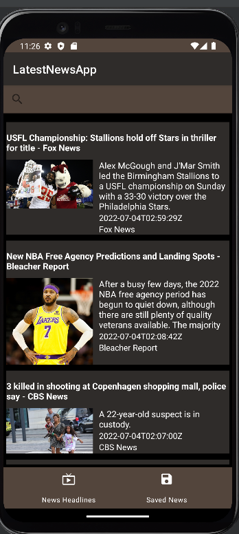
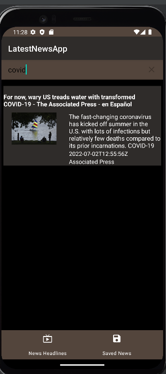

# NewsAPIApp

* This app fetches data from the newsapi.org API.
* You can see the latest news in the app.
* If you like a piece of news you can save the news in your app.
* It also gives you the feature of searching the news from the latest news.

 

# Main Screen
* You can see latest news here.
* You can also tap on any news to read full article.
* Then from there you can save the article.

# News Article
* This page shows you the full article of the news you clicked.
* You can save the news from the bottom right corner.

# Search News
* You can search for a piece of news in the news.
* As shown by searching covid it shows news rekated to covid.

# Saved News 
* This page shows the news you have saved so far.
* You can also delete a news from this by sliding the news then a snackbar will appear and you can delete your news.

